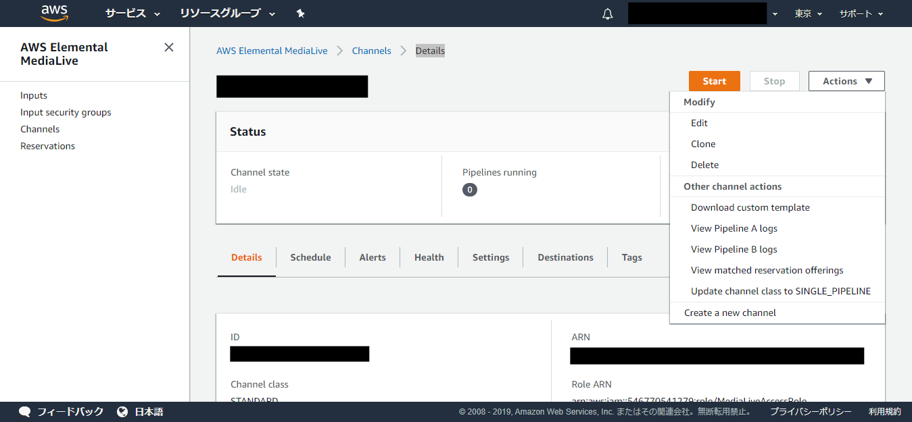
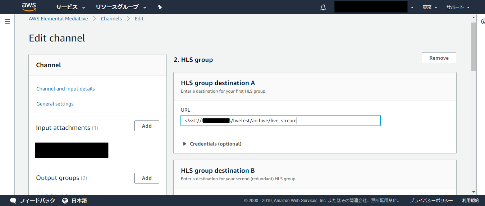
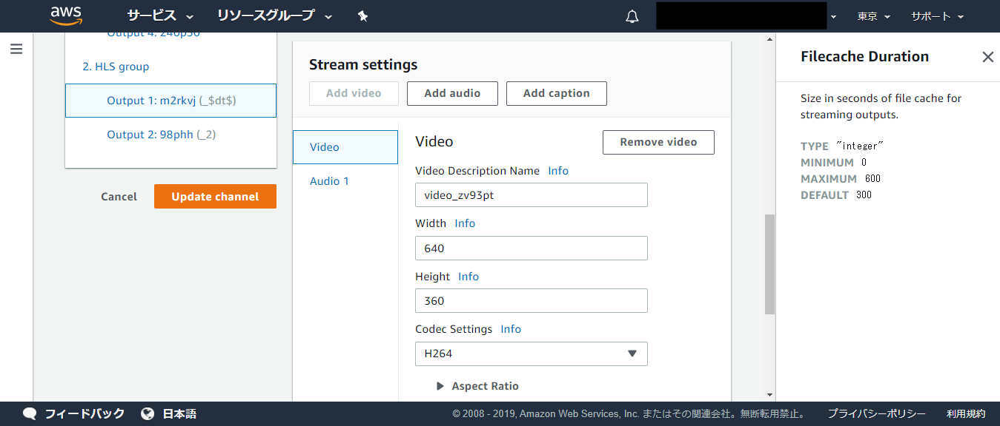
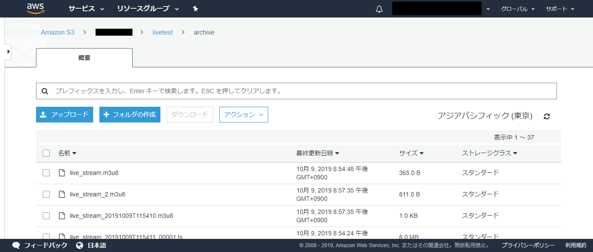
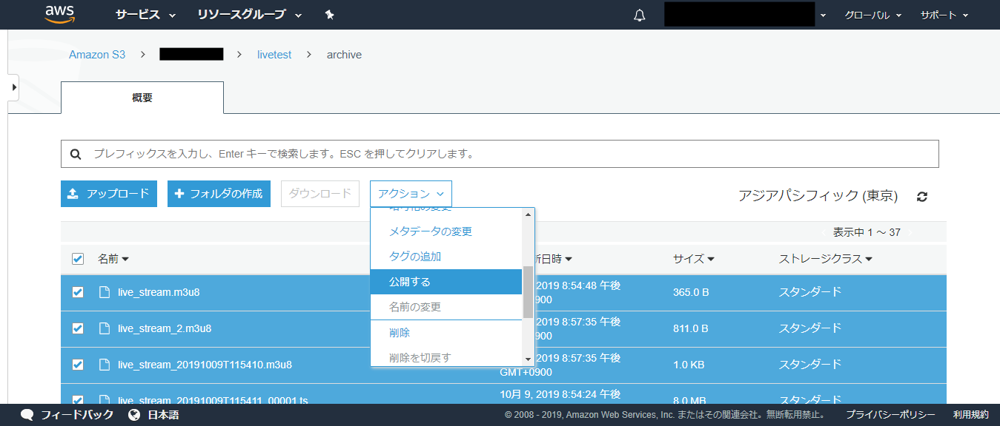
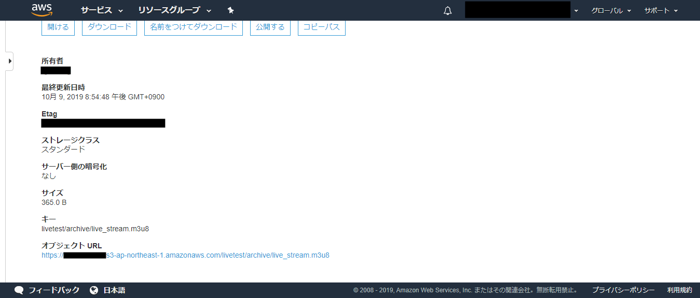

MediaLive では、リアルタイムのライブ配信だけでなく、ライブ配信した動画をアーカイブとして保存して、後でオンデマンド配信することができます。

アーカイブを作成する方法はいくつかありますが、今回は、マニフェストファイル（.m3u8）も自動的に作られる、HLS output group
を使用する方法を使用します。

HLS output group は HLS 形式で動画ファイルを出力するための出力タイプです。

アーカイブファイルを保存するための S3 のバケットを事前に用意しておいてください。

----

# S3のバケットの作成方法

1.AWSマネジメントコンソールから、サービス->ストレージ->s3を選択。

2.バケットを作成する。
(アクセス許可の設定において、「パブリックアクセスをすべてブロック」のチェックボックスのチェックを外し、外部からアクセスできるようにします。）

# アーカイブ作成方法

1.AWSマネジメントコンソールから、サービス->メディアサービス->MediaLiveを選択。

AWS Elemental MediaLive＞ChannelsでCannelを選択、Details画面へ遷移。

2.右上の「Action」から「Edit」を選びます。

3.左側のメニューにある「Output groups」欄の「Add」ボタンを押して、表示された「Add output
group」画面で、「HLS」を選択して「Confirm」ボタンを押します。

4.HLS output group の設定画面が開くので、以下のように入力します。

- HLS group destination A

URL：
アーカイブファイルを保存する S3 のバケットを以下の形式で指定します。

s3ssl://[バケット名]/[パス/][プレフィックス]

例：s3ssl://sample-live-s3/livetest/archive/live_stream
  
パス ： アーカイブファイルを保存するディレクトリのパス（上の例では「livetest/archive/」）  
プレフィックス ： アーカイブファイルの先頭につける共通名（上の例では「live_stream」）  

- HLS group destination B

バックアップのURLを指定します。

例：s3ssl://sample-live-s3/livetest/archive-backup/live_stream

- HLS settings

CDN settings : 「Hls basic put」を選択します（その他はデフォルトのままにしておきます）

- HLS outputs

Name modifierで、出力されるファイルの名前を指定できます。
Name modifierは通常の文字列の他、
MediaLiveで使用できる変数データ識別子が使用できます。今回は日付日時情報YYYYMMDDTHHMMSSと変換される$dt$を使用して、_$dt$としました。
出力されるファイル名は、最終的にはlive_stream_YYYYMMDDTHHMM.[000000].tsとなります。  
live_streamはHLSgroup destinationAでS3のパスとともに入力した値、[000000]は6桁のシーケンシャルカウンターがMediaLiveにより付与されます。
Output 1のActionsのSettingsをクリックすると、Output 1の詳細設定画面に遷移します。

- Rate Control  
Rate Control Mode：VBRに変更  

高解像度を扱う場合は、VBR（可変ビットレート）のほうが、同容量のCBR（固定ビットレート）よりも高品質になり、処理も早くなります。  
  
Stream settingsのところで、解像度の設定ができますので、費用の面で、とりあえず低解像にしておきます。  
ビットレートの設定がデフォルトのままだと高額の費用がかかるので、開発中はもっと低い値に設定し直しておいたほうが良いです。  
設定し直す箇所は以下のスクリーンショットを参照してください。

- Rate Control  
Bitrate：5000000(デフォルト)→適宜変更(最低1000。動作確認であれば最低値でも可)  
- Additional settings  
Max Bitrate：適宜変更(最低1000。動作確認であれば最低値でも可) を入力  

左メニューの2.HLS Groupを選択して元の画面に戻ります。

- Manifest and Segments

Mode : 「VOD」を選択します（その他の設定はデフォルトのままにしておきます）

必要な項目の入力が終わったら、「Update Channel」ボタンを押して保存します。

5.アーカイブの確認

アーカイブ設定をした後、ライブ配信を行うと、指定したバケットに以下のようにアーカイブファイルが出力されます。

セグメントファイルに加えてマニフェストファイル（.m3u8）も自動で生成されています。

外部から視聴できるように、公開設定をします。

ファイルのチェックボックスをすべてチェックして（名前の左横にあるチェックボックスにチェックを入れるとすべてのファイルにチェックがつきます）、「Action→公開する」を選択します。

アーカイブ視聴用URLは、マニフェストファイル（.m3u8）を選択して表示されるオブジェクトURLになります。  
（今回の場合は https://sample-live-s3.s3-ap-northeast-1.amazonaws.com/livetest/archive/live_stream.m3u8 ）

