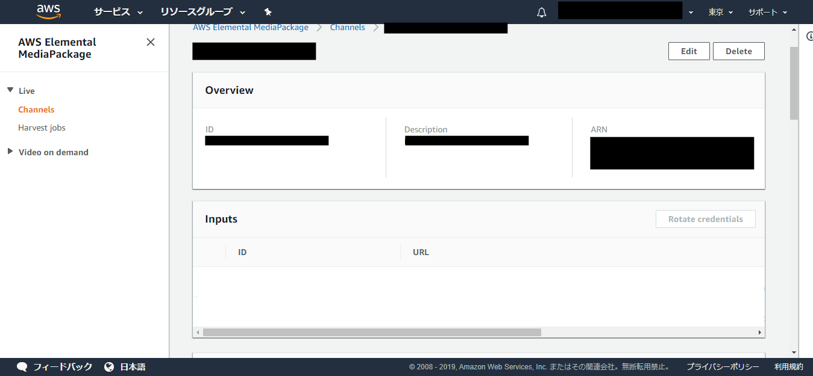
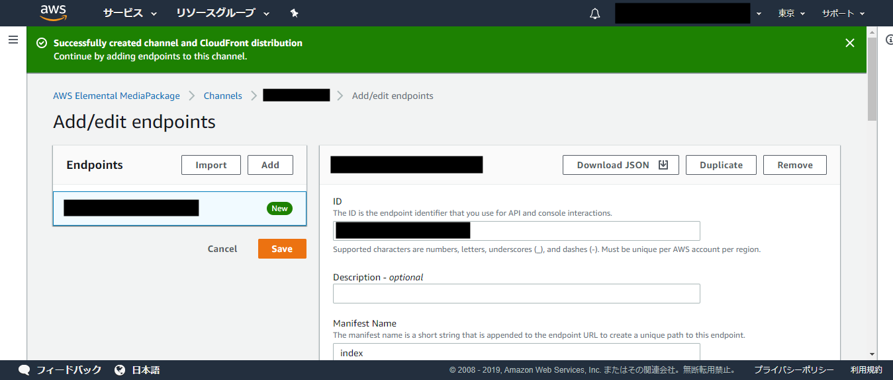
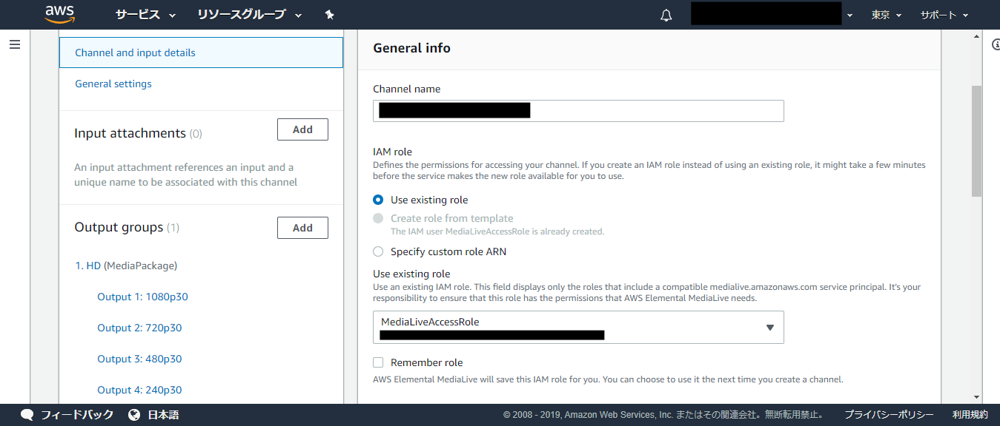
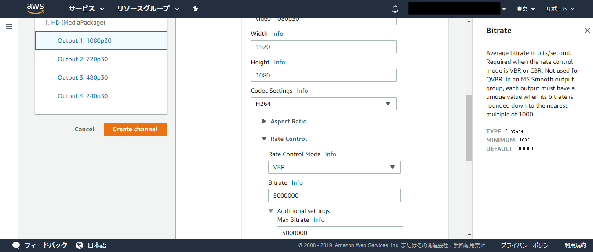

**IDやnameの入力値は、適宜変更してください。**

----

# 1.MediaPackageでのチャンネル設定

AWSマネジメントコンソールから、サービス->メディアサービス->MediaPackageを選択。

リージョンはアジアパシフィック (東京)を選択。

channels画面に遷移するので、右上のCreateボタンを押す。

IDとDescriptioneに「SampleChannel1」を入力、InputTypeは「Apple HLS」を選択、CloudFront
distribution detailsは「Create a CloudFront distribution for this
channel」を選択し、右下のCreateを押す。

これで、Channelが作成されました。

Endpointsを追加します。Add Endpointsボタンを押す。

IDにSampleIChanneIMPEndpoint1と入力、Packager settingsはApple HLSを選択。
他の項目はとりあえず初期値のままで、Saveボタンを押す。

遅延関連

- Segment duration (sec)  
1秒-2秒に設定（バッファの設定です。この値を小さくすると遅延時間が短くなりますが、再生が不安定になります）
- Live playlist window duration (sec)  
Segment duration × 3 程度に設定（m3u8ファイルに記録する全tsファイルの合計再生時間です。Segment durationが1秒なら、3秒を設定すると、3つのtsファイルが記録されます）

Channels画面に戻り、作成したチャンネルができていることを確認。

# 2.Media Liveでのチャンネル設定

AWSマネジメントコンソールから、サービス->メディアサービス->MediaLiveを選択。右上のCreate channelを押す。

Create channelのChannel and input detailsで、Channel templateに「Live
event(MediaPackage)」を選択。

General infoのChannel nameにSampleLiveChannelと入力。

IAM roleは、Use existing roleRoleを選択し、Roleを指定する。
初めての場合はCreate role from templateを選択し、IAMRoleを作り、作ったRoleを指定する。

左側にあるInput attachmentsのAddを押す。

Attach inputのCreate inputを押す。

Input nameにSampleInputChannelと入力。
Input typeはRTMP (push)を選択。
Input security groupでCreateを選び、ボックスの値に0.0.0.0/0と入力。
Input security groupを押す。

Use existingに、今作った security groupが選択されていることを確認。

同じ画面で下にスクロールし、Input destinationsにApplication
name/instanceをSampleA/A、SampleB/Bに設定（以下のスクリーンショットを参照）。
Createを押す。

Create channel画面のAttach inputに戻るので、先ほど作ったinputを選択。
comfirmを押す。

左側にあるOutput groupsの1.HDを選択、MediaPackage destionationのMediaPackage
channel IDに、「手順1、MediaPackageでのチャンネル設定」で作成したMediaPackage
ChannelのID(今回の場合は「SampleChannel1」)を入力する。

Outputですが、ビットレートの設定がデフォルトのままだと高額の費用がかかるので、もっと低い値に設定し直しておいたほうがよいです。
Output 1～4まですべて設定し直してください（設定し直す箇所はスクリーンショットを参照してください）。

参考：
- Rate Control  
Rate Control Mode：VBRに変更  
高解像度を扱う場合は、VBR（可変ビットレート）のほうが、同容量のCBR（固定ビットレート）よりも高品質になり、処理も早くなります。  
Bitrate：5000000(デフォルト)→適宜変更(最低1000。動作確認であれば最低値でも可)  
- Additional settings  
Max Bitrate：適宜変更(最低1000。動作確認であれば最低値でも可) を入力  

左側の下にあるCreateChannelを押せば、Live Channel作成が完了。

AWS Elemental MediaLive>Channels画面に作成したLive ChannelがIdle状態で
できていることを確認。

# 3.Live配信手順

AWSマネジメントコンソールから、サービス->メディアサービス->MediaPackageを選択。
Channels一覧からID項目のSampleChannel1リンクをクリック。

EndpointsのURL項目にあるShow CloudFront URLの文字をクリックすると、  

https://xxxxx.cloudfront.net/out/v1/xxxxx/index.m3u8  

といったようなURLが表示されます。それが視聴用のURLとなります。

- 次に、配信ソフトの設定です（OBS https://obsproject.com を使った場合の手順です）。

1.右下の設定を押す。

2.左の配信をクリック。

配信種別：カスタムストリーミングサーバー

URL：
AWSマネジメントコンソールから、サービス->メディアサービス->MediaLiveを選択し、AWS Elemental
MediaLive>InputsでName項目のSampleInputChannelリンクをクリックして表示される、EndpointsのURLの値の、最後の/の前まで（今回の場合、rtmp://xxx.xxx.xxx.xxx:xxxx/SampleA）を入力。

ストリームキー：
EndpointsのURLの最後の/の後の値（今回の場合A）を入力。

3.画面下部のOKを押す。

4.AWS Elemental MediaLive>Channels画面でName項目のSampleLiveChannelをクリックします。

5.Details画面で、上部右のstartを押す。

6.StatusのChannel stateがStartingからRunningになったら、OBSに戻る。

7.右下にある配信開始を押すと、配信が開始される。

8.視聴用URLはこちらです（どこに表示されているかは、上述の説明をご参照ください）。

例：  
https://xxxxx.cloudfront.net/out/v1/xxxxx/index.m3u8

MacのSafariまたはiphone/Androidの標準ブラウザにてご確認ください。

# 4.Live配信終了手順

1.OBSの右下にある配信終了を押すと、配信を終了します。

2.SampleLiveChannelのDetails画面の上部右のstopを押す。

3.StatusのChannel stateがStoppingからIdleになったら終了。
