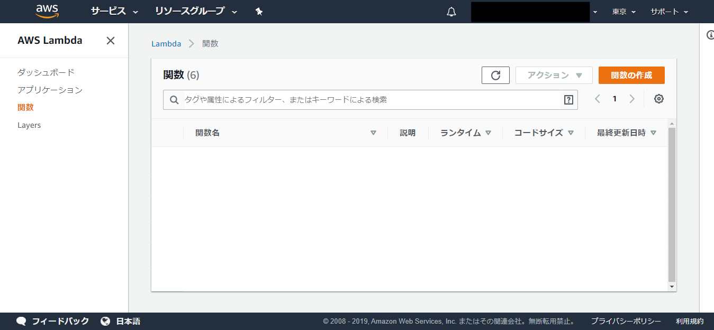
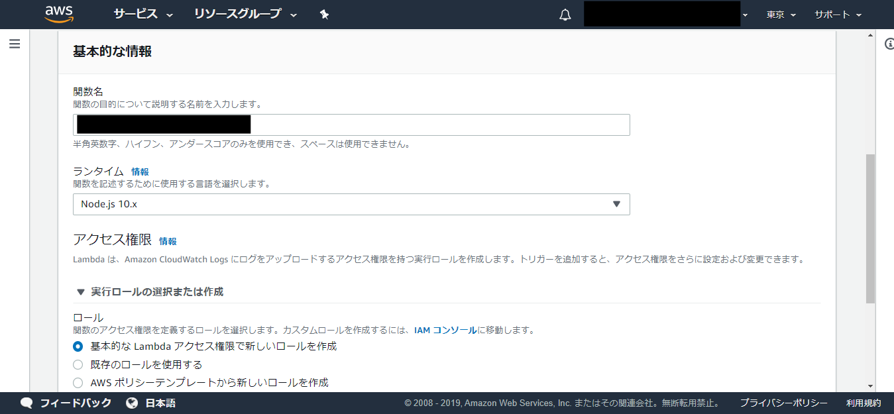
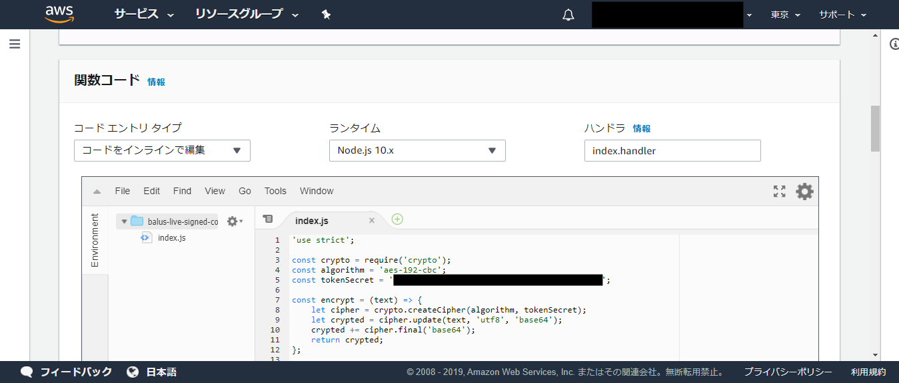
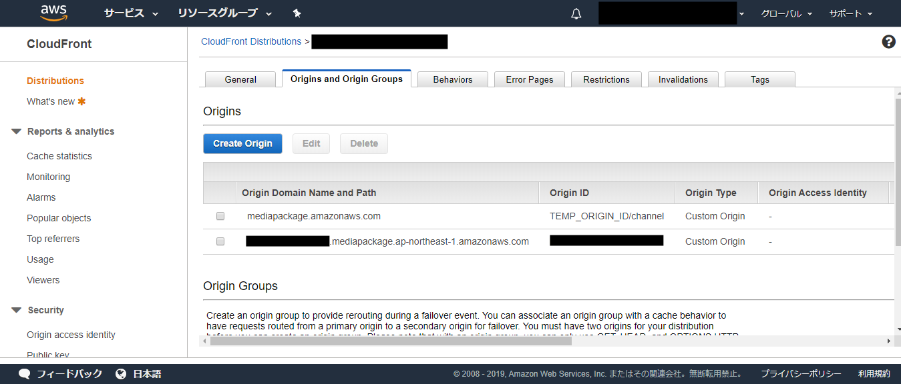
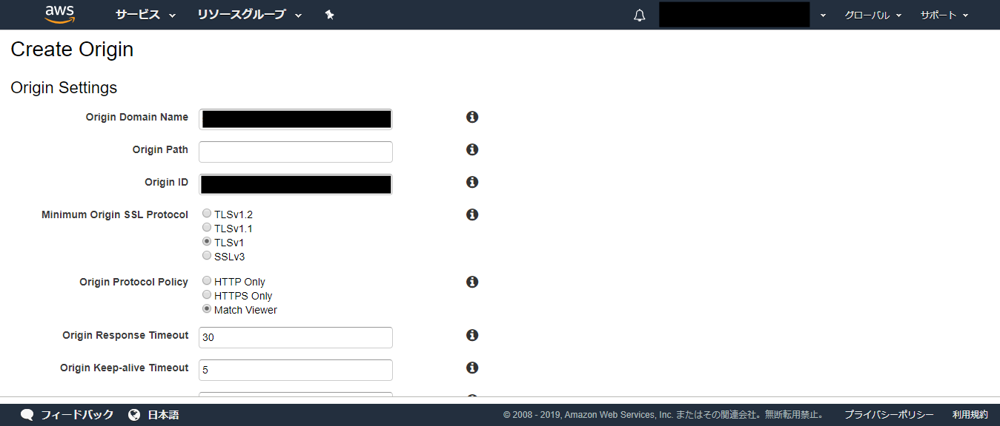
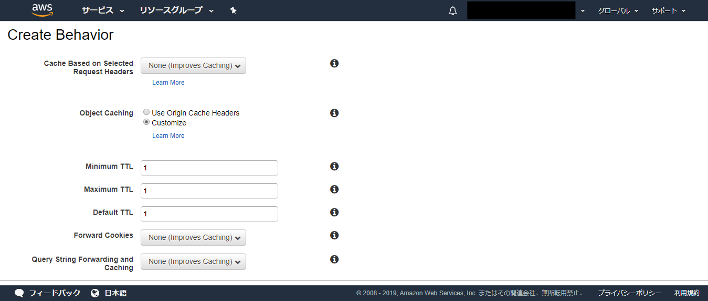
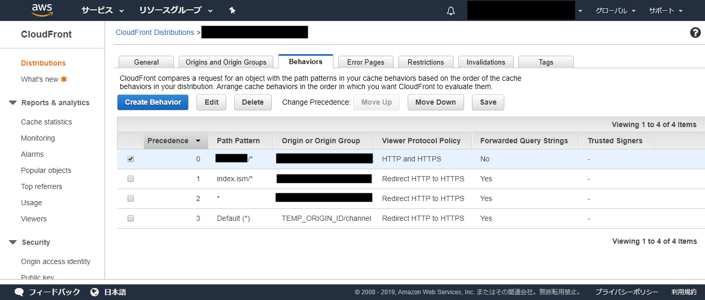
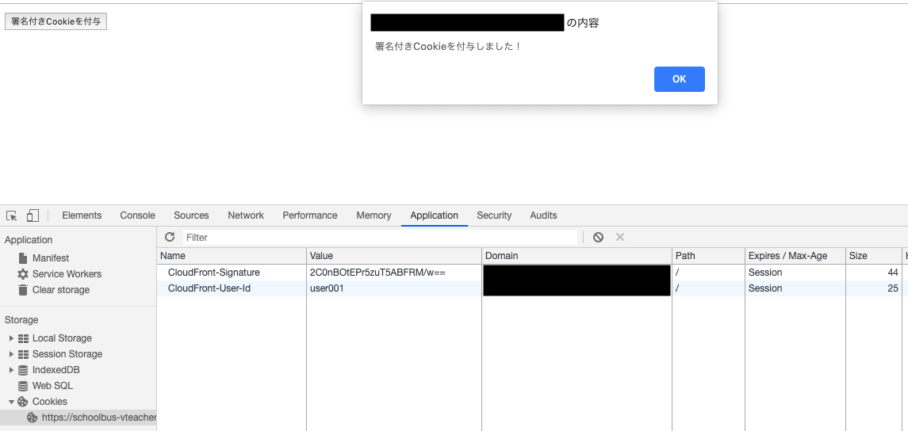
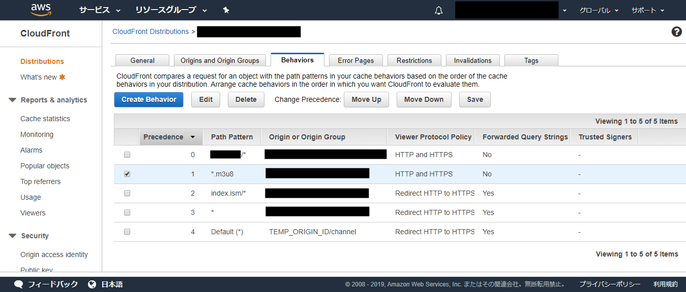
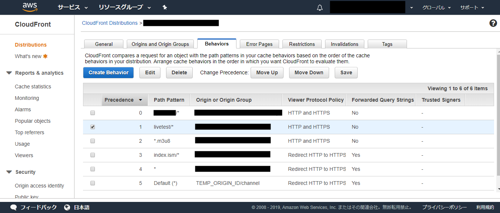

システム構成図


----

Cookie認証用のLambdaを登録していきます。

Lambdaの種類

1、ジェネレータ

ユーザID毎に簡易的な署名を生成します。

ソース  
`sample-live-demo-lambda-signed-cookies-generator/index.js`

```
'use strict';

const crypto = require('crypto');
const algorithm = 'aes-192-cbc';
const tokenSecret = 'balus-live-demo-tokensecret1234567890abcdef';

const encrypt = (text) => {
    let cipher = crypto.createCipher(algorithm, tokenSecret);
    let crypted = cipher.update(text, 'utf8', 'base64');
    crypted += cipher.final('base64');
    return crypted;
};

exports.handler = function (event, context) {
    const signature = encrypt(event.userId);
    const cookieCfSignature = `CloudFront-Signature=${signature}`;
    const json = {signature: cookieCfSignature};

    context.succeed(json);
};
```

2、バリデータ

署名が正しいか判定します。

ソース  
`sample-live-demo-lambda-signed-cookies-validator/index.js`

```
'use strict';

const crypto = require('crypto');
const algorithm = 'aes-192-cbc';
const tokenSecret = 'balus-live-demo-tokensecret1234567890abcdef';

const decrypt = (text) => {
    let decipher = crypto.createDecipher(algorithm, tokenSecret);
    let dec = decipher.update(text, 'base64', 'utf8');
    dec += decipher.final('utf8');
    return dec;
};

const parseCookies = (headers) => {
    const parsedCookie = {};
    if (headers.cookie) {
        headers.cookie[0].value.split(';').forEach((cookie) => {
            if (cookie) {
                const parts = cookie.split('=');
                parsedCookie[parts[0].trim()] = parts[1].trim();
            }
        });
    }
    return parsedCookie;
};

exports.handler = (event, context, callback) => {
    try {
        const request = event.Records[0].cf.request;
        const headers = request.headers;

        const parsedCookies = parseCookies(headers);
        const userId = parsedCookies['CloudFront-User-Id'];
        const sendSignature = parsedCookies['CloudFront-Signature'];

        if (decrypt(sendSignature) !== userId) {
            throw new Error("error");
        }

        callback(null, request);

    } catch (error) {
        let response = {
            status: '401',
            statusDescription: 'Unauthorized',
        };
        callback(null, response);
    }
};
```

まず、ジェネレータを登録します。
Lambdaのコンソールを開きます。



右上の「関数の作成」を押します。

関数の基本的な情報を入力します。
ランタイムはNode.js 10.×を選択してください。

ロールは適切なものを作成または選択してください。



右下の「関数の作成」を押します。

関数コードのindex.jsを、GitHubからのコードをコピーして置き換えます。

ソース（上述、同じ内容）  
`sample-live-demo-lambda-signed-cookies-generator/index.js`

```
'use strict';

const crypto = require('crypto');
const algorithm = 'aes-192-cbc';
const tokenSecret = 'balus-live-demo-tokensecret1234567890abcdef';

const encrypt = (text) => {
    let cipher = crypto.createCipher(algorithm, tokenSecret);
    let crypted = cipher.update(text, 'utf8', 'base64');
    crypted += cipher.final('base64');
    return crypted;
};

exports.handler = function (event, context) {
    const signature = encrypt(event.userId);
    const cookieCfSignature = `CloudFront-Signature=${signature}`;
    const json = {signature: cookieCfSignature};

    context.succeed(json);
};
```

右上の「保存」をクリック。



ジェネレータの呼び出し処理を書いたHTMLファイルは、御社の管理するWEBサーバーに置いてください。
ジェネレータの呼び出し方は、こちらを参考にしてください。

ソース  
`signed-cookies.html`

```
<!DOCTYPE html>
<html lang="ja">
<head>
    <meta name="viewport" content="width=device-width,initial-scale=1">
    <meta charset="utf-8">
    <title>Live streaming player(HLS) - Demo</title>
</head>
<body>
<script src="https://sdk.amazonaws.com/js/aws-sdk-2.1.36.min.js"></script>
<script type="text/javascript">
    let uid = "";
    let accessKeyIdValue = "";
    let secretAccessKeyValue = "";

    function setSignedCookies() {
        if (accessKeyIdValue === "" || secretAccessKeyValue === "") {
            alert("未ログインまたはチケット未購入です！");
            return;
        }

        AWS.config.update({
            accessKeyId: accessKeyIdValue,
            secretAccessKey: secretAccessKeyValue
        });
        AWS.config.region = 'ap-northeast-1';
        let lambda = new AWS.Lambda();
        let params = {
            FunctionName: 'balus-live-demo-lambda-signed-cookies-generator',
            Payload: JSON.stringify({userId: uid})
        };

        lambda.invoke(params, function (err, data) {
            if (err) {
                console.log(err, err.stack);
                alert("失敗しました！");
            } else {
                JSON.parse(data.Payload, function (key, value) {
                    if (key !== "") {
                        document.cookie = value + ";path=/";
                    }
                });
                document.cookie = "CloudFront-User-Id=" + uid + ";path=/";
                alert("署名付きCookieを付与しました！");
            }
        });
    }

    alert("署名付きCookieを書き込みます。ボタンを押してください！");
</script>
<button onclick="setSignedCookies();">署名付きCookieを付与</button>
<br>
<br>
<a href="javascript:history.back()">戻る</a>
<br>
<script src="https://www.gstatic.com/firebasejs/5.0.4/firebase-app.js"></script>
<script src="https://www.gstatic.com/firebasejs/5.0.4/firebase-firestore.js"></script>
<script src="https://www.gstatic.com/firebasejs/5.0.4/firebase-auth.js"></script>
<script src="https://www.gstatic.com/firebasejs/5.0.4/firebase-functions.js"></script>
<script>
    const firebaseConfig = {
        apiKey: "*****",
        authDomain: "*****",
        databaseURL: "*****",
        projectId: "*****",
        storageBucket: "*****",
        messagingSenderId: "*****",
        appId: "*****"
    };
    firebase.initializeApp(firebaseConfig);

    const db = firebase.firestore();
    db.settings({
        timestampsInSnapshots: true
    });

    firebase.auth().onAuthStateChanged((user) => {
        if (user) {
            uid = user.uid;
            initPage(user.uid);
        }
    });

    function initPage(uid) {
        db.collection('tickets').where('uid', '==', uid).get().then(doc => {
            validateTicketState(doc.docs[0].id);
        });
    }

    async function validateTicketState(documentId) {
        const documentSnapshot = await db.collection('tickets').doc(documentId).get();
        const record = documentSnapshot.data();

        if (record.ticket == "bought") {
            pullAccessKey();
        }
    }

    async function pullAccessKey() {
        const documentSnapshot = await db.collection('signed-cookies').doc('MXlieFg4itdUtW1PrnXJ').get();
        const record = documentSnapshot.data();

        accessKeyIdValue = record.accessKeyId;
        secretAccessKeyValue = record.secretAccessKey;
    }
</script>
</body>
</html>
```

ライブ配信設定で使ったCloudFrontを介して、御社のWEBサイトが閲覧できるように設定します。

まず、CloudFrontのコンソールを開きます。

Origins and Originsタブをクリックして、開いた画面で「Create Origin」を押します。



Origin Domain Nameは御社のWEBサイトを入力してください。
Origin Protocol Policyは適宜変更してください。

画面右下部の「Create」を押します。



Behaviorタブをクリックして、開いた画面で「Create Behavior」を押します。
Path Patternに、御社のWEBサーバーに実在するフォルダを指定してください。

Object CachingはCustomizeを選択し、Minimum TTL、Maximum TTL、Default
TTLの値はキャッシュの時間になりますので、適宜変更してください。
（この例ではすべて1にしてあります。）
画面右下部の「Create」を押します。



Behaviorタブの画面に戻るので、先ほど作ったBehaviorを選択し、Change Precedence:「Move
Up」ボタンをクリックして一番上の場所（Precedenceが0の場所）に移動し、「Save」を押してください。



ジェネレータを呼び出すHTMLを御社のサーバーに置きます。
置き場所は、スクリーンショットの例ではこのようになっています。

例  
https://schoolbus-vteacher.ssl-lolipop.jp/sample-live

このHTMLに最低限必要なコードは以下になっています。

最低限のバリデータ検証用html
```
<!DOCTYPE html>
<html lang="ja">
<head>
    <meta charset="utf-8">
</head>
<body>
<script src="https://sdk.amazonaws.com/js/aws-sdk-2.1.36.min.js"></script>
<script type="text/javascript">
    let uid = "user001"; // TODO: 適宜変更
    let accessKeyIdValue = "御社のアクセスキー"; // TODO: 適宜変更
    let secretAccessKeyValue = "御社のシークレットアクセスキー"; // TODO: 適宜変更
    function setSignedCookies() {
        AWS.config.update({
            accessKeyId: accessKeyIdValue、
            secretAccessKey: secretAccessKeyValue
        });
        AWS.config.region = 'ap-northeast-1';
        let lambda = new AWS.Lambda();
        let params = {
            FunctionName: 'sample-live-signed-cookies-generator'、
            Payload: JSON.stringify({userId: uid})
        };
        lambda.invoke(params、 function (err、 data) {
            if (err) {
                console.log(err、 err.stack);
                alert(err.stack);
            } else {
                JSON.parse(data.Payload、 function (key、 value) {
                    if (key !== "") {
                        document.cookie = value + ";path=/";
                    }
                });
                document.cookie = "CloudFront-User-Id=" + uid + ";path=/";
                alert("署名付きCookieを付与しました！");
            }
        });
    }
    alert("署名付きCookieを書き込みます。ボタンを押してください！");
</script>
<button onclick="setSignedCookies();">署名付きCookieを付与</button>
</body>
</html>
```

実際にアクセスして動作確認します。

「署名付きCookieを付与」ボタンを押して、正しく付与されることを確認してください。

ブラウザの開発ツール等で、Cookieの中身を確認し、

- CloudFront-Signature
- CloudFront-User-Id

の値が書き込まれていることを確認してください。

例  
https://schoolbus-vteacher.ssl-lolipop.jp/sample-live/signed-cookies.html



次に、バリデータのLambdaを登録します。
Lambdaのコンソールを開きます。

Lambda>関数のページを開き、右上のリージョン選択を「米国東部 (バージニア北部) 」に変更します。

<参考URL>
Lambda@Edge 公式  
https://docs.aws.amazon.com/ja_jp/AmazonCloudFront/latest/DeveloperGuide/lambda-edge-how-it-works-tutorial.html  
※Lambda@Edgeは us-east-1(バージニア北部) で利用できるため、バリデータ用のLambda は us-east-1 に登録してください。

「関数の作成」を押します。

関数の基本的な情報を入力します。
ランタイムはNode.js 10.×を選択してください。

ロールは適切なものを作成または選択してください。


右下の「関数の作成」を押します。

関数コードのindex.jsを、gitHubからのコードをコピーして置き換えます。
  
ソース  
https://github.com/sample-co-ltd/sample-live-demo/tree/feature/chat-ban-fullscreen-cookie/backend/aws/lambda/sample-live-demo-lambda-signed-cookies-validator

右上の「保存」をクリック。

CloudFrontに組み込むため、バージョンを発行します。
「Action」→「新しいバージョンを発行」を選択します。


バージョンの説明は任意入力、右下の「発行」を押します。

右上のARNの値を、右端のアイコンをクリックするとコピーできるので、コピーしてください。


今回の例だと、下記の値になります。
  
arn:aws:lambda:us-east-1:546770541279:function:sample-live-signed-cookies-validator:1
  
ジェネレータの時と同様に、CloudFrontのコンソールを開きます。
Behaviorタブをクリックします。
「Create Behavior」を押します。

- Path Pattern：  
*.m3u8
  
- Origin or Origin Group：  
EMPから始まる名前のサーバーを選択します（メディアサービスが自動で作成したライブサーバーです）。


- Object Caching：  
Customize

Minimum TTL、Maximum TTL、Default TTLの値はキャッシュの時間になりますので、適宜変更してください。
（この例ではすべて1にしてあります。）


画面の下のほうにあるLambda Function Associationsは、
以下のように設定してください。

- CloudFront Event：  
Viewer Request
- Lambda Function ARN：  
バリデーションLambda登録時にコピーしたARNの値


画面右下部の「Create」を押します。

Behaviorタブの画面に戻るので、先ほど作ったBehaviorを選択し、Change Precedence:「Move
Up」ボタンをクリックして、ジェネレータを作成したときに登録したBehavior(今回の例ではPath
Patternがsample-live/*）の次の場所（つまりPrecedenceが1の場所）に移動し、「Save」を押してください。



別紙ライブストリーミングのマニュアルを参考に、ライブ配信をしてください。

MacのSafariまたはiphone/Androidの標準ブラウザで視聴用のURLを再生してみると、再生できないと思います（Cookieを認証していないため）。
上で説明したように、メディアサービスが作成したCloudFrontに御社のWEBサーバーを登録したので、CloudFront経由で認証画面にアクセスしてください。

例：CloudFront経由のURLに変える  
https://schoolbus-vteacher.ssl-lolipop.jp/sample-live/signed-cookies.html  
↓  
https://d34sphxlrhuwcz.cloudfront.net/sample-live/signed-cookies.html  

Cookieの付与をしてから、再度視聴用のURLで再生してみてください。
今度は視聴できたと思います。

----

アーカイブも、同様の設定をすることで、簡易的なCookie認証による視聴者制限ができます。
下記のスクリーンショットを参照にしてください。各Precedenceはスクリーンショットのようにしてください。




アーカイブ視聴用URL例：CloudFront経由のURLに変える

https://sample-live-s3.s3-ap-northeast-1.amazonaws.com/livetest/archive/live_stream.m3u8  
↓  
https://d34sphxlrhuwcz.cloudfront.net/livetest/archive/live_stream.m3u8  
（署名付きCookieを付与後、再生可能になります）
